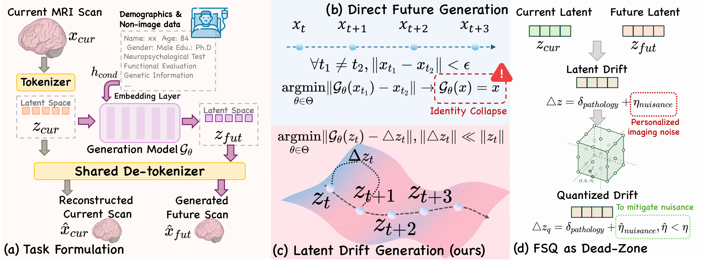
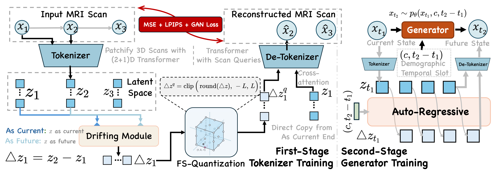

<h1 align="center">Progression as Latent Drift</h1>
<h3 align="center">Generative Forecasting of Slow-Evolving Pathologies</h3>

<p align="center">
    <a href="https://cutepkq.github.io/latent-drift/"></a>
    <a href="https://arxiv.org/abs/2607.08270"></a>
    <a href="https://huggingface.co/Radiance666/Progression-as-Latent-Drift"></a>
    <a href="LICENSE"></a>
    
</p>

<p align="center">
    <a href="#-about">About</a> •
    <a href="#-framework">Framework</a> •
    <a href="#-quickstart">Quickstart</a> •
    <a href="#-data-preparation">Data</a> •
    <a href="#-configuration">Configuration</a> •
    <a href="#-training">Training</a> •
    <a href="#-inference">Inference</a> •
    <a href="#-citation">Citation</a>
</p>

<br>

# 🧠 About

<p align="center">
    
</p>

Forecasting the future anatomy of slow-evolving neurodegenerative diseases could
enable earlier intervention and better clinical-trial design, but it is hard
because true progression signals are **subtle** in longitudinal MRI — across a
typical one-year interval, disease-related change can be under **1%** of the
total volumetric variance. In this low-signal regime, transplanting modern
generative sequence models fails in two structural ways:

- **Identity collapse** — the stationary background overwhelms the biological
  signal, so a model trained to synthesize the absolute future state collapses
  toward reproducing the current anatomy instead of learning the faint drift.
- **Continuous interpolation trap** — shifting the target to the temporal
  residual Δz still forces any Lipschitz-continuous predictor to interpolate the
  dense nuisance noise, smearing spurious change across the volume.

We propose **Latent Drift**, a two-stage progressive framework that learns
change in a **compressed semantic space** rather than re-synthesizing
full-resolution anatomy. A residual objective removes pixel-level identity from
the prediction target (escaping identity collapse), and **Finite Scalar
Quantization (FSQ)** acts as a *topological dead-zone filter* — noise below the
quantization threshold is mapped exactly to zero while consistent structural
drift is preserved; because rounding is non-Lipschitz, this breaks the
continuous interpolation trap.

On longitudinal 3D brain MRI from **ADNI + AIBL** (3,981 current–future pairs),
Latent Drift attains the best structural agreement (**Diff-SSIM 0.8204**,
**NCC 0.9880**) and downstream clinical utility (**Accuracy 88.33**,
**F₁ 87.51**), outperforming diffusion and autoregressive-transformer baselines.

<br>

# 🧩 Framework

<p align="center">
    
</p>

Latent Drift predicts **latent progression** in two stages:

| Stage | Component | Code | What it does |
|-------|-----------|------|--------------|
| **1 · Latent Drift Tokenizer** | `LatentActionQuantization` | `src/models/ldt.py` + `src/modules/vqvae/ldt_fsq.py` | Encodes the pre/post MRI pair, models the continuous latent drift Δz = z<sub>fut</sub> − z<sub>cur</sub>, and quantizes it into discrete drift tokens with **FSQ** |
| **2 · Decoder-Transformer** | `Net2NetTransformer` | `src/models/medical_ldt.py` + `src/modules/transformer/action_gpt.py` | Autoregressively forecasts the discrete drift tokens, conditioned on the patient's **baseline anatomy** and **time gap**, then decodes them back into the predicted future volume |

Entry points: `main.py` (LightningCLI training) and `infer.py` (sampling → mp4 / npy / nii).

<br>

# 🚀 Quickstart

## 1. 🐍 Environment

```bash
conda create -n latentdrift python=3.10 -y && conda activate latentdrift
# Install PyTorch first. We use torch 2.10 & CUDA 12.8 — adjust to your CUDA version.
pip install torch==2.10.0 torchvision==0.25.0 torchaudio==2.10.0 --index-url https://download.pytorch.org/whl/cu128
pip install -r requirements.txt
```

## 2. 📦 Pretrained weights

```bash
hf download Radiance666/Progression-as-Latent-Drift --local-dir checkpoints
```

<br>

# 🗂️ Data Preparation

**1. Convert raw scans to normalized volumes.** `data/process.py` reads a text
file listing `.nii.gz` paths and writes normalized `.npy` volumes under
`data/processed_np_case/`. Each scan is clipped to the HU range, normalized to
`[-1, 1]`, center-padded and trilinearly resampled to shape `(1, 93, 112, 96)`.

```bash
python data/process.py
```

Point it at your data by editing the `CTVideoConfig` in the `__main__` block
(`txt_file`, `input_root`, `output_dir`), or generate the path list first with
the provided `save_nii_paths_to_txt(folder_path, output_txt_path)` helper.

**2. Provide a CSV of longitudinal pairs.** The dataset
(`src/data/ct_video.py`) reads a CSV whose columns are:

| Column | Meaning |
|--------|---------|
| `pre_path` | `.npy` filename of the baseline scan (under `token_dir`) |
| `post_path` | `.npy` filename of the follow-up scan |
| `time_dif` | Month gap between the two scans (bucketed to 6-month bins internally) |
| `pre_dx` / `post_dx` | Diagnosis labels at each visit |

The processed data format follows `data/case.csv`, e.g.:

```csv
pre_path,post_path,time_dif,pre_dx,post_dx
scan_f8b367fd30a1.npy,scan_1ff4c3aa99ba.npy,6,0,0
scan_835f1fad52b4.npy,scan_9fa1a47a2953.npy,12,0,0
```

The CSV path is set in each config's `data` section.

<br>

# ⚙️ Configuration

Training and inference are driven by the two YAML configs under `configs/`.
Point them at your data and adjust model / trainer settings there — no code
changes needed.

| Config | Used for |
|--------|----------|
| `configs/ldt_fsq.yaml` | Stage 1 — Latent Drift Tokenizer |
| `configs/ldt_fsq_gen.yaml` | Stage 2 — Decoder-Transformer generator |

**Point to your data.** In the `data.init_args` section of each config, set the
CSV for each split (the same file may be reused if you split elsewhere):

```yaml
data:
  class_path: main.DataModuleFromConfig
  init_args:
    batch_size: 8            # per-GPU batch size
    num_workers: 16
    train:
      target: src.data.ct_video.CTVideoDataset
      params:
        config:
          csv_file: data/case.csv          # <-- your CSV
          # token_dir: data/processed_np_case   # (optional) where the .npy live
```

**Hardware / precision (`trainer`).** `devices` sets the GPU count (Stage 1 ships
with `8`, Stage 2 with `1`), `precision: bf16-mixed`, `max_epochs`, and the
`ModelCheckpoint` / `LearningRateMonitor` callbacks. Checkpoints are written to
`dirpath` (e.g. `checkpoints/ldt_fsq/`).

**Logging.** Both configs use `WandbLogger` in **offline** mode by default. Set
`offline: false` (and log in with `wandb login`) to stream metrics, or swap in
`TensorBoardLogger`.

**Key model knobs.**

- *Stage 1* (`model.init_args`): `code_seq_len`, `patch_size`,
  `spatial_depth` / `temporal_depth`, and the FSQ settings under
  `vq_config.params`.
- *Stage 2* (`transformer_config.params`): `vocab_size`, `dim`, `n_head`,
  `spatial_n_layer`, `grid_thw` / `mrope_section` (must match the tokenizer's
  token layout), and `token_drop` for classifier-free guidance.

**Resume.** Set the top-level `ckpt_path:` to a checkpoint to resume training.
Stage 2 loads the frozen Stage-1 tokenizer via `ldt_config` — set its
`ckpt_path` to your trained tokenizer.

<br>

# 🏋️ Training

Train the two stages in order:

```bash
# Stage 1: latent drift tokenizer
python main.py fit -c configs/ldt_fsq.yaml

# Stage 2: generator (forecasts the drift tokens)
python main.py fit -c configs/ldt_fsq_gen.yaml
```

<br>

# 🎬 Inference

Run the pretrained generator on the test split:

```bash
python infer.py
```

Optional flags:

| Flag | Default | Description |
|------|---------|-------------|
| `--config` | `configs/ldt_fsq_gen.yaml` | Config file |
| `--checkpoint` | `checkpoints/generator.ckpt` | Generator checkpoint |
| `--output_dir` | `output/ldt_gen` | Output directory |
| `--temperature` | `1.2` | Sampling temperature |
| `--top_k` / `--top_p` | `None` | Optional top-k / nucleus sampling |
| `--save_nii` | off | Also save generated / gt / source volumes as `.nii.gz` |

Outputs are written under `output_dir/`:

```
output/ldt_gen/
├── np/       # raw arrays: generated, ground-truth, and (gen − source) / (gt − source) drift
├── video/    # source | ground-truth | generated comparison mp4
└── nii/      # per-sample .nii.gz volumes (when --save_nii is set)
```

<br>

# 📁 Project Layout

```
configs/    training / inference configs (ldt_fsq.yaml, ldt_fsq_gen.yaml)
data/       preprocessing (process.py), pair list (case.csv), processed .npy volumes
src/
  models/     ldt.py (Stage 1), medical_ldt.py (Stage 2)
  modules/    autoencoder, transformer, vqvae (FSQ), losses, discriminator
  data/       ct_video.py (longitudinal pair dataset)
main.py     LightningCLI entry point for training
infer.py    inference / sampling script
```

<br>

# 📑 Citation

If you find this project useful for your research, please consider citing:

```bibtex
@inproceedings{feng2026latentdrift,
  title     = {Progression as Latent Drift: Generative Forecasting of Slow-Evolving Pathologies},
  author    = {Feng, Yuxiang and Wang, Juncheng and Xu, Chao and Hou, Wenlong and
               Wang, Huihan and Qian, Yijie and Liu, Yang and Sun, Baigui and
               Liu, Yong and Wang, Shujun},
  booktitle = {European Conference on Computer Vision (ECCV)},
  year      = {2026}
}

@article{feng2026latentdrift_arxiv,
  title   = {Progression as Latent Drift: Generative Forecasting of Slow-Evolving Pathologies},
  author  = {Feng, Yuxiang and Wang, Juncheng and Xu, Chao and Hou, Wenlong and
             Wang, Huihan and Qian, Yijie and Liu, Yang and Sun, Baigui and
             Liu, Yong and Wang, Shujun},
  journal = {arXiv preprint arXiv:2607.08270},
  year    = {2026}
}
```
